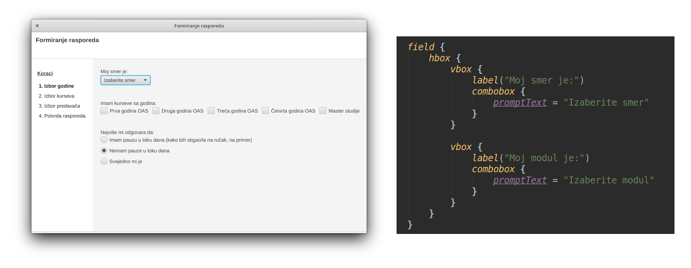

## Grafički korisnički interfejs

- [TornadoFX](https://tornadofx.io/) - biblioteka za Kotlin koja koristi JavaFX u pozadini 
- Koristi lambda izraze za definisanje hijerarhije

## Prikupljanje informacija od korisnika

- [Jsoup](https://jsoup.org/) - biblioteka za parsiranje podataka sa veba
- Svako pristupanje vebu se radi na zasebnoj niti

## Planiranje

- [OptaPlanner](https://www.optaplanner.org/) - biblioteka za optimizaciju
- Podržava korišćenje više različitih optimizacionih algoritama
- [Drools](https://www.drools.org/) - sistem za definisanje ograničenja

# Hvala na pažnji

# Pitanja?
